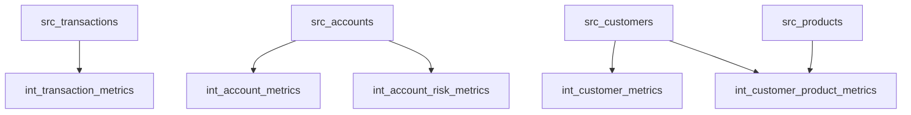

# FinFlow Analytics 📊 

> Enterprise Financial Data Analytics Platform with dbt & BigQuery 💰

## Table of Contents 📑
- [Overview](#overview)
- [Project Structure](#project-structure)
- [Data Architecture](#data-architecture)
- [Installation & Setup](#installation--setup)
- [Development Workflow](#development-workflow)
- [Contributing](#contributing)

## Overview 🎯
FinFlow Analytics is a comprehensive dbt (data build tool) project designed for financial data analytics using BigQuery as the data warehouse. The project implements a modern data modeling approach with bronze (raw), silver (intermediate), and gold (business-ready) layers, featuring robust data quality testing and financial metric calculations.

## Project Structure 📁
```
finflow_analytics/
├── analyses/           # Ad-hoc analytical queries
├── macros/            # Reusable SQL snippets and utilities
├── models/            # Core data transformation logic
│   ├── bronze/        # Raw data ingestion layer
│   ├── silver/        # Intermediate transformations
│   └── gold/          # Business-ready data models
├── tests/             # Data quality tests
├── snapshots/         # Change data capture configurations
├── dbt_project.yml    # Project configurations
├── packages.yml       # External package dependencies
└── sources.yml        # Source definitions and tests
```

## Data Architecture 🏗️

### Layer Overview 🔄

#### 1. Bronze Layer (Raw) 🥉
- Direct source data ingestion with minimal transformation
- Incremental loading with merge strategy
- Source freshness monitoring

#### 2. Silver Layer (Intermediate) 🥈
- Account metrics and risk analysis
- Customer behavior analytics
- Transaction pattern analysis
- Product adoption metrics

#### 3. Gold Layer (Business) 🥇
- Dimension tables (customer, account, product, location, date)
- Fact tables (transactions, account balances)
- Business-ready metrics

### Model Dependencies 🔗


## Installation & Setup 🚀

### 1. Environment Setup ⚙️
```bash
# Create virtual environment
python -m venv venv
source venv/bin/activate  # Linux/Mac
venv\Scripts\activate     # Windows

# Install dependencies
pip install dbt-bigquery
pip install dbt-utils
```

### 2. BigQuery Configuration 🔧
```yaml
# ~/.dbt/profiles.yml
finflow_analytics:
  target: dev
  outputs:
    dev:
      type: bigquery
      method: oauth/service-account
      project: finflow-analytics-production
      dataset: finflow_data
      location: US-CENTRAL1
      threads: 4
```

### 3. Project Initialization 🏁
```bash
git clone https://github.com/your-org/finflow-analytics.git
cd finflow-analytics
dbt deps
dbt seed
dbt run --full-refresh
```

## Development Workflow 💻

### Daily Operations ⚡
```bash
# Check source freshness
dbt source freshness

# Run incremental updates
dbt run --models tag:daily

# Run tests
dbt test

# Generate docs
dbt docs generate
dbt docs serve
```

### Model Configuration ⚙️
```yaml
models:
  finflow_analytics:
    bronze:
      +materialized: incremental
      +incremental_strategy: merge
      +schema: bronze
    silver:
      +materialized: view
      +schema: silver
    gold:
      +materialized: table
      +schema: gold
```

## Contributing 🤝

### Development Process 🛠️
1. Fork the repository
2. Create feature branch: `git checkout -b feature/your-feature-name`
3. Make changes and test: `dbt test && dbt run`
4. Submit PR with clear description and tests

### Code Style Guidelines 📝
- Use uppercase for SQL keywords
- Include model documentation
- Follow naming conventions for models and tests
- Add appropriate tests for new features

---
*Last updated: January 21, 2025* 📅
