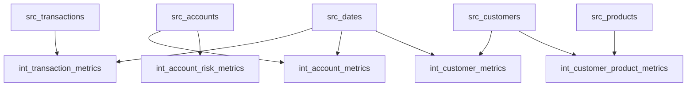
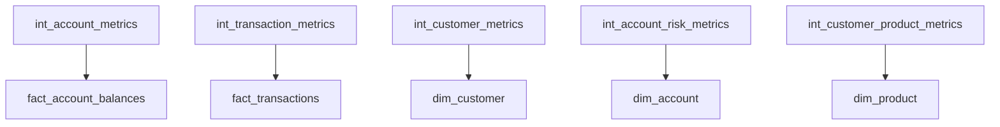

# FinFlow Analytics 📊 

> Enterprise Financial Data Analytics Platform with dbt & BigQuery 💰

## Table of Contents 📑
- [Overview](#overview-)
- [Project Structure](#project-structure-)
- [Data Architecture](#data-architecture-)
- [Key Analyses](#key-analyses-)
- [Custom Macros](#custom-macros-)
- [Data Quality Framework](#data-quality-framework-)
- [Installation & Setup](#installation--setup-)
- [Development Workflow](#development-workflow-)
- [Contributing](#contributing-)
- [Support](#support-)


## Overview 🎯
FinFlow Analytics is a comprehensive dbt (data build tool) project designed for financial data analytics using BigQuery as the data warehouse. The project implements a modern data modeling approach with bronze (raw), silver (intermediate), and gold (business-ready) layers, featuring robust data quality testing and financial metric calculations.

## Project Structure 📁
```
finflow_analytics/
├── analyses/           # Ad-hoc analytical queries
│   ├── customer_lifetime_value.sql
│   ├── product_profitability.sql
│   └── risk_analysis.sql
├── macros/            # Reusable SQL snippets and utilities
│   ├── growth_rate.sql
│   ├── deduplicate_records.sql
│   ├── cleanup_tests.sql
│   ├── compare_row_counts_with_threshold.sql
│   ├── test_credit_utilization.sql
│   └── test_positive_amounts.sql
├── models/            # Core data transformation logic
│   ├── bronze/        # Raw data ingestion layer
│   │   ├── src_customers.sql
│   │   ├── src_accounts.sql
│   │   ├── src_transactions.sql
│   │   ├── src_products.sql
│   │   ├── src_locations.sql
│   │   └── src_dates.sql
│   ├── silver/        # Intermediate transformations
│   │   ├── int_account_metrics.sql
│   │   ├── int_account_risk_metrics.sql
│   │   ├── int_customer_metrics.sql
│   │   ├── int_customer_product_metrics.sql
│   │   └── int_transaction_metrics.sql
│   └── gold/          # Business-ready data models
│       ├── dim_customer.sql
│       ├── dim_account.sql
│       ├── dim_product.sql
│       ├── dim_location.sql
│       ├── dim_date.sql
│       ├── fact_transactions.sql
│       └── fact_account_balances.sql
├── tests/             # Data quality tests
│   ├── assert_balance_matches_transactions.sql
│   ├── assert_positive_amounts.sql
│   └── assert_valid_dates.sql
├── snapshots/         # Change data capture configurations
│   └── customer_snapshot.sql
├── dbt_project.yml    # Project configurations
├── packages.yml       # External package dependencies
├── package-lock.yml   # Package version lock file
└── sources.yml        # Source definitions and tests
```

## Data Architecture

### Source Tables Overview 📊

#### Customer Data
- Primary key: `customer_key`
- Demographics and segmentation
- Customer activity metrics
- SCD Type 2 tracking for history
```sql
SELECT 
    customer_key,
    customer_id,
    first_name,
    last_name,
    email,
    customer_segment,
    customer_since_date,
    total_accounts,
    active_accounts
FROM src_customers
```

#### Account Data
- Primary key: `account_key`
- Account status and balances
- Credit limits and minimum balances
- Product relationships
```sql
SELECT 
    account_key,
    account_id,
    customer_key,
    product_key,
    account_type,
    account_status,
    initial_deposit,
    balance,
    credit_limit
FROM src_accounts
```

#### Transaction Data
- Primary key: `transaction_id`
- Transaction types: Deposit, Withdrawal, Transfer, Payment
- Amount and fee tracking
```sql
SELECT 
    transaction_id,
    account_key,
    customer_key,
    transaction_type,
    transaction_amount,
    fee_amount,
    transaction_status
FROM src_transactions
```

### Layer Overview 🔄

#### 1. Bronze Layer (Raw) 🥉
- Direct source data ingestion with minimal transformation
- Incremental loading with merge strategy
- Source freshness monitoring
```yaml
sources:
  - name: finflow_analytics_production
    database: finflow-analytics-production
    schema: finflow_data
    loaded_at_field: "ingestion_timestamp"
    freshness:
      warn_after: {count: 24, period: hour}
      error_after: {count: 48, period: hour}
```

#### 2. Silver Layer Models (Intermediate) 🥈

##### Account Analytics
1. **Account Metrics** (`int_account_metrics`)
```sql
-- Key metrics calculated:
- daily_transactions: Daily transaction count
- net_daily_change: Net balance change per day
- daily_fees: Fee accumulation
- monthly_transactions: Monthly aggregation
- month_over_month_growth: Growth rate calculation
```

2. **Risk Metrics** (`int_account_risk_metrics`)
```sql
-- Risk indicators tracked:
- below_minimum_balance_flag: Balance threshold monitoring
- credit_utilization_pct: Credit usage percentage
- rapid_transaction_count: Transactions within 5 minutes
```

##### Customer Analytics
1. **Customer Metrics** (`int_customer_metrics`)
```sql
-- Metrics tracked:
- daily_transactions: Transaction frequency
- daily_volume: Transaction amounts
- monthly_metrics: Monthly aggregations
- month_over_month_growth: Growth patterns
```

2. **Product Adoption** (`int_customer_product_metrics`)
```sql
-- Adoption metrics:
- product_categories_used: Category diversity
- product_subcategories_used: Detailed product usage
- first_product_date: Initial adoption
- latest_product_date: Most recent adoption
- active_products_count: Current product usage
```

##### Transaction Intelligence
**Transaction Patterns** (`int_transaction_metrics`)
```sql
-- Pattern analysis:
- transaction_count: Frequency metrics
- total_amount: Volume analysis
- avg_amount: Transaction size patterns
- volume_category: High/Normal/Low classification
```

#### 3. Gold Layer (Business) 🥇

##### Dimension Tables
```sql
- dim_customer: Customer master data
- dim_account: Account information
- dim_product: Product catalog
- dim_location: Geographic hierarchy
- dim_date: Date dimension
```

##### Fact Tables
```sql
- fact_transactions: Transaction history
- fact_account_balances: Daily balance snapshots
- fact_customer_metrics: Customer-level metrics
```

## Key Analyses 📈

### Customer Lifetime Value Analysis 👥
```sql
WITH customer_revenue AS (
    SELECT
        c.customer_key,
        c.customer_segment,
        DATE_DIFF(CURRENT_DATE, c.customer_since_date, MONTH) as tenure_months,
        SUM(t.transaction_amount) as total_revenue,
        SUM(t.fee_amount) as total_fees
    FROM dim_customer c
    LEFT JOIN fact_transactions t 
        ON c.customer_key = t.customer_key
    WHERE t.transaction_type IN ('Deposit', 'Fee')
    GROUP BY 1, 2, 3
)
```

### Product Profitability Analysis 📊
```sql
WITH product_metrics AS (
    SELECT
        p.product_key,
        p.product_name,
        p.product_category,
        COUNT(DISTINCT a.account_key) as total_accounts,
        SUM(t.transaction_amount) as total_volume,
        SUM(t.fee_amount) as total_fees,
        AVG(a.balance) as avg_balance
    FROM dim_product p
    LEFT JOIN dim_account a ON p.product_key = a.product_key
    LEFT JOIN fact_transactions t ON a.account_key = t.account_key
    GROUP BY 1, 2, 3
)
```

### Risk Analysis ⚠️
```sql
WITH risk_metrics AS (
    SELECT
        a.account_key,
        c.customer_segment,
        p.product_category,
        arm.credit_utilization_pct,
        arm.below_minimum_balance_flag,
        arm.rapid_transaction_count
    FROM dim_account a
    JOIN dim_customer c ON a.customer_key = c.customer_key
    JOIN dim_product p ON a.product_key = p.product_key
    JOIN int_account_risk_metrics arm ON a.account_key = arm.account_key
)
```

## Custom Macros 🛠️

### Financial Calculations 🧮
1. **Growth Rate Calculator**
```sql

    CASE
        WHEN {{ previous_value }} IS NULL OR {{ previous_value }} = 0 
        THEN NULL
        ELSE ROUND(
            ({{ current_value }} - {{ previous_value }}) / 
            ABS({{ previous_value }}) * 100,
            2
        )
    END

```

2. **Record Deduplication**
```sql

    SELECT *
    FROM (
        SELECT 
            *,
            ROW_NUMBER() OVER (
                PARTITION BY {{ key_column }}
                ORDER BY {{ order_by_column }} DESC
            ) as row_num
        FROM {{ relation }}
    )
    WHERE row_num = 1

```

3. **Test Results Cleanup**
```sql

    
        SELECT 'DROP TABLE `' || table_catalog || '.' || 
               table_schema || '.' || table_name || '`'
        FROM INFORMATION_SCHEMA.TABLES 
        WHERE table_name LIKE 'test_%'
    

```

## Data Quality Framework ✅

### Source Freshness Monitoring
```yaml
freshness:
  warn_after: {count: 24, period: hour}
  error_after: {count: 48, period: hour}
```

### Automated Tests
1. **Balance Validation**
```sql
WITH transaction_totals AS (
    SELECT
        account_key,
        SUM(CASE 
            WHEN transaction_type IN ('Deposit', 'Transfer In') 
            THEN amount
            WHEN transaction_type IN ('Withdrawal', 'Transfer Out') 
            THEN -amount
        END) as calculated_balance
    FROM fact_transactions
    GROUP BY account_key
)
```

2. **Date Validation**
```sql
SELECT date_key, full_date
FROM dim_date
WHERE full_date > '2025-12-31'
   OR full_date < '2025-01-01'
```

3. **Amount Validation**
```sql
SELECT transaction_id, amount
FROM fact_transactions
WHERE amount < 0
```

### Data Snapshot Strategy
```sql

{{
    config(
      target_schema='snapshots',
      unique_key='customer_key',
      strategy='timestamp',
      updated_at='updated_at',
      invalidate_hard_deletes=True
    )
}}

```

### Testing Configuration 🧪
```yaml
tests:
  finflow_analytics:
    +store_failures: false
    +severity: error
    +warn_if: ">0"
    +error_if: ">100"
    
  assert_balance_matches_transactions:
    +tags: ['finance', 'balance_validation']
    +error_if: '>500'
    +warn_if: '>100'
    
  assert_valid_dates:
    +tags: ['finance', 'date_validation']
    +error_if: '>500'
    +warn_if: '>100'
```

## Model Dependencies 📊

### Bronze to Silver Dependencies


### Silver to Gold Dependencies


## External Packages 📦
```yaml
packages:
  - package: dbt-labs/dbt_utils
    version: 1.3.0
  - package: calogica/dbt_expectations
    version: 0.10.4
  - package: calogica/dbt_date
    version: 0.10.1
```

## Installation & Setup 🚀

### 1. Environment Setup
```bash
# Create virtual environment
python -m venv venv
source venv/bin/activate  # Linux/Mac
venv\Scripts\activate     # Windows

# Install dependencies
pip install dbt-bigquery
pip install dbt-utils
```

### 2. BigQuery Configuration
```yaml
# ~/.dbt/profiles.yml
finflow_analytics:
  target: dev
  outputs:
    dev:
      type: bigquery
      method: oauth/service-account
      project: finflow-analytics-production
      dataset: finflow_data
      location: US-CENTRAL1
      threads: 4
```

### 3. Project Initialization
```bash
# Clone repository
git clone https://github.com/your-org/finflow-analytics.git
cd finflow-analytics

# Install dbt packages
dbt deps

# Seed initial data
dbt seed

# Run full refresh
dbt run --full-refresh
```

## Development Workflow 💻

### Daily Operations
1. **Source Freshness Check**
```bash
dbt source freshness
```

2. **Incremental Updates**
```bash
dbt run --models tag:daily
```

3. **Data Quality Checks**
```bash
dbt test
```

### Maintenance Tasks
1. **Test Result Cleanup**
```bash
dbt run-operation cleanup_test_results
```

2. **Documentation Generation**
```bash
dbt docs generate
dbt docs serve
```

3. **Emergency Full Refresh**
```bash
dbt run --full-refresh --models tag:critical
```

## Development Standards 📝

### Model Configuration
```yaml
models:
  finflow_analytics:
    bronze:
      +materialized: incremental
      +incremental_strategy: merge
      +schema: bronze
    silver:
      +materialized: view
      +schema: silver
    gold:
      +materialized: table
      +schema: gold
```

### Naming Conventions
1. **Bronze Layer**
   - Models: `src_*`
   - Tests: `test_src_*`

2. **Silver Layer**
   - Models: `int_*`
   - Tests: `test_int_*`

3. **Gold Layer**
   - Dimensions: `dim_*`
   - Facts: `fact_*`
   - Tests: `test_gold_*`

4. **Generic Tests**
   - Assertions: `assert_*`
   - Validations: `validate_*`

5. **Custom Macros**
   - Utilities: `util_*`
   - Calculations: `calc_*`

### Code Style Guidelines
1. **SQL Formatting**
   ```sql
   -- Use uppercase for SQL keywords
   SELECT 
       column_name,
       other_column
   FROM table_name
   WHERE condition = true
   GROUP BY 1
   ```

2. **Model Documentation**
   ```yaml
   version: 2
   models:
     - name: model_name
       description: "Detailed description"
       columns:
         - name: column_name
           description: "Column purpose"
           tests:
             - unique
             - not_null
   ```

3. **Test Documentation**
   ```yaml
   tests:
     - name: test_name
       description: "Test purpose"
       tags: ['category']
       severity: error
   ```

## Contributing 🤝

### Getting Started
1. **Fork the Repository**
```bash
# Clone your fork
git clone https://github.com/your-username/finflow-analytics.git
cd finflow-analytics

# Add upstream remote
git remote add upstream https://github.com/original-org/finflow-analytics.git
```

2. **Create Feature Branch**
```bash
git checkout -b feature/your-feature-name
```

3. **Development Process**
```bash
# Update your branch
git fetch upstream
git merge upstream/main

# Make changes and test
dbt test
dbt run

# Commit changes
git add .
git commit -m "feat: your feature description"
```

### Pull Request Process
1. **Update Documentation**
   - Add model documentation
   - Update README if needed
   - Add test cases

2. **Review Checklist**
   - [ ] All tests passing
   - [ ] Documentation updated
   - [ ] Code follows style guide
   - [ ] No data quality issues
   - [ ] Performance impact considered

3. **Submit PR**
   - Clear description of changes
   - Reference related issues
   - Tag appropriate reviewers

## Maintenance 🔧

### Regular Tasks
1. **Daily Operations**
   - Monitor source freshness
   - Check incremental loads
   - Review error logs

2. **Weekly Tasks**
   - Clean up test results
   - Review performance metrics
   - Update documentation

3. **Monthly Tasks**
   - Full refresh validation
   - Package updates
   - Historical data archival

### Monitoring
1. **Data Quality**
   ```bash
   # Run all tests
   dbt test

   # Check specific models
   dbt test --models tag:critical

   # Source freshness
   dbt source freshness
   ```

2. **Performance**
   ```bash
   # Get run timing
   dbt run --profiles-dir profiles --profile prod -t prod
   ```

3. **Error Handling**
   ```python
   try:
       # Your dbt commands
   except Exception as e:
       # Log and alert
       alert_team(f"DBT Error: {str(e)}")
   ```

## Troubleshooting 🔍

### Common Issues
1. **Incremental Load Failures**
   ```sql
   -- Check for duplicates
   SELECT count(*), key_column
   FROM your_table
   GROUP BY key_column
   HAVING count(*) > 1
   ```

2. **Data Quality Issues**
   ```sql
   -- Balance validation
   SELECT *
   FROM assert_balance_matches_transactions
   WHERE ABS(balance_difference) > 1.00
   ```

3. **Performance Problems**
   ```sql
   -- Check query performance
   SELECT 
       query_id,
       total_bytes_processed,
       total_slot_ms,
       creation_time
   FROM `region-us`.INFORMATION_SCHEMA.JOBS_BY_PROJECT
   WHERE creation_time >= TIMESTAMP_SUB(CURRENT_TIMESTAMP(), INTERVAL 24 HOUR)
   ORDER BY total_slot_ms DESC
   LIMIT 10
   ```

### Resolution Steps
1. **Data Load Issues**
   - Check source freshness
   - Validate incremental logic
   - Review error logs

2. **Test Failures**
   - Analyze test results
   - Check data consistency
   - Review recent changes

3. **Performance Issues**
   - Review model materialization
   - Check join conditions
   - Optimize SQL

## Support 💬

### Getting Help
1. **Documentation**
   - Check inline documentation
   - Review model descriptions
   - Consult this README

2. **Issue Reporting**
   - Use GitHub issues
   - Follow issue template
   - Provide reproduction steps

---
*Last updated: January 21, 2025*
